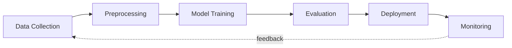

<div align="center">


<br>


</div>

---

## About

```python
# profile.py
class Engineer:
    name      = "Subhankar Nandi"
    role      = ["AI Engineer", "ML Developer", "Data Analyst"]
    focus     = ["Machine Learning", "Deep Learning", "GenAI", "Data Analytics"]
    building  = "LLM + RAG application"
    learning  = ["Advanced MLOps", "System Design"]
    side_quest = "Writing poetry"
    open_to   = ["AI / ML projects", "Data analytics", "Collaboration"]
    motto     = "Learn. Build. Ship. Repeat."
```

Ask me about model training, RAG pipelines, or dashboards.

---

## Workflow



---

## Tech Stack

| Category | Technologies |
|---|---|
| **Languages** |  |
| **ML / Deep Learning** |  |
| **GenAI / LLM** |     |
| **Data & Visualization** |      |
| **Backend / Web** |  |
| **Databases** |  |
| **Tools & Platforms** |  |

---

## Featured Projects

| Project | Description | Stack |
|---|---|---|
| [**Real-Time Human Detection (YOLOv8)**](https://github.com/subhankarnandi777/Real-Time-Human-Detection-using-YOLOv8-for-Disaster-Management) | Detects humans in real time to support search and rescue in disaster management. | `Python` `YOLOv8` `OpenCV` `Deep Learning` |
| [**Subhankar.OS**](https://github.com/subhankarnandi777/Subhankar.OS) | Custom operating system covering kernel development, process scheduling and memory management. | `C` `C++` `Operating Systems` |
| [**Handwriting Personality AI**](https://github.com/subhankarnandi777/handwriting_personality_ai) | Predicts personality traits from handwriting using deep learning and computer vision. | `Python` `TensorFlow` `OpenCV` |

---

## GitHub Analytics

<p align="center">


</p>

<p align="center">

</p>

<p align="center">

</p>

<p align="center">

</p>

<p align="center">
<picture>
<source media="(prefers-color-scheme: dark)"
srcset="https://raw.githubusercontent.com/subhankarnandi777/subhankarnandi777/output/github-snake-dark.svg">
<source media="(prefers-color-scheme: light)"
srcset="https://raw.githubusercontent.com/subhankarnandi777/subhankarnandi777/output/github-snake.svg">

</picture>
</p>

---

## Contact

```json
{
  "email": "subhankarnandi2006@gmail.com",
  "linkedin": "linkedin.com/in/subhankar-nandi-09a83b317",
  "instagram": "@poetic_subho",
  "availability": "open to work"
}
```

<div align="center">

<a href="https://www.linkedin.com/in/subhankar-nandi-09a83b317"></a>
<a href="mailto:subhankarnandi2006@gmail.com"></a>
<a href="https://www.instagram.com/poetic_subho"></a>
<a href="https://www.facebook.com/share/1danjmvzoe/"></a>

<br><br>


</div>
