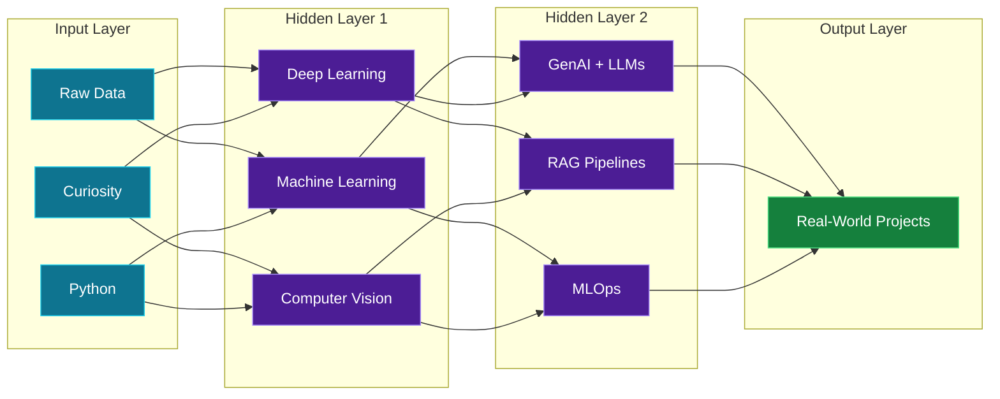

<div align="center">


<br>


</div>


## `model.summary()`

```text
Model: "Subhankar_Nandi_v1"
______________________________________________________________________________
 Layer (type)                Output
==============================================================================
 role (Dense)                AI Engineer / ML Developer / Data Analyst
 focus (Conv2D)              Machine Learning, Deep Learning, GenAI, Analytics
 building (Transformer)      LLMs + RAG pipelines
 learning (LSTM)             Advanced MLOps, System Design
 side_quest (Dropout)        Writing poetry
 output (Softmax)            Learn. Build. Ship. Repeat.
==============================================================================
Status: OPEN TO WORK  |  Trainable params: curiosity, consistency
______________________________________________________________________________
```


## `architecture.png`




## `layers/` &nbsp;Tech Stack

<table>
<tr>
<td width="22%"><b>Input Layer</b><br><sub>Languages</sub></td>
<td></td>
</tr>
<tr>
<td><b>Hidden Layers</b><br><sub>ML / Deep Learning</sub></td>
<td> </td>
</tr>
<tr>
<td><b>Attention Layer</b><br><sub>GenAI / LLM</sub></td>
<td>  </td>
</tr>
<tr>
<td><b>Data Pipeline</b><br><sub>Analysis &amp; Viz</sub></td>
<td>    </td>
</tr>
<tr>
<td><b>Output Layer</b><br><sub>Deploy &amp; Serve</sub></td>
<td></td>
</tr>
</table>


## `experiments/`

<table>
<tr>

<td width="33%" valign="top">

```text
experiment_01
```

**Real-Time Human Detection**

YOLOv8 model that detects humans in real time for disaster management and search and rescue.

`Python` `YOLOv8` `OpenCV`

[`view_experiment()`](https://github.com/subhankarnandi777/Real-Time-Human-Detection-using-YOLOv8-for-Disaster-Management)

</td>

<td width="33%" valign="top">

```text
experiment_02
```

**Subhankar.OS**

Custom operating system covering kernel development, process scheduling and memory management.

`C` `C++` `OS Dev`

[`view_experiment()`](https://github.com/subhankarnandi777/Subhankar.OS)

</td>

<td width="33%" valign="top">

```text
experiment_03
```

**Handwriting Personality AI**

Deep learning and computer vision model that predicts personality traits from handwriting.

`Python` `TensorFlow` `OpenCV`

[`view_experiment()`](https://github.com/subhankarnandi777/handwriting_personality_ai)

</td>

</tr>
</table>


## `metrics/` &nbsp;Training Logs

<p align="center">


</p>

<p align="center">

</p>

<p align="center">

</p>

<p align="center">

</p>

<p align="center">
<picture>
<source media="(prefers-color-scheme: dark)"
srcset="https://raw.githubusercontent.com/subhankarnandi777/subhankarnandi777/output/github-snake-dark.svg">
<source media="(prefers-color-scheme: light)"
srcset="https://raw.githubusercontent.com/subhankarnandi777/subhankarnandi777/output/github-snake.svg">

</picture>
</p>


## `model.deploy()` &nbsp;Contact

```python
endpoint = {
    "email":    "subhankarnandi2006@gmail.com",
    "linkedin": "linkedin.com/in/subhankar-nandi-09a83b317",
    "instagram": "@poetic_subho",
    "status":   "open to work",
}
```

<div align="center">

<a href="https://www.linkedin.com/in/subhankar-nandi-09a83b317"></a>
<a href="mailto:subhankarnandi2006@gmail.com"></a>
<a href="https://www.instagram.com/poetic_subho"></a>
<a href="https://www.facebook.com/share/1danjmvzoe/"></a>

<br><br>


</div>
