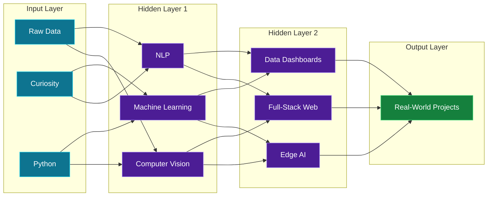

<div align="center">


<br>


<br><br>

<a href="https://subhankar-os.vercel.app"></a>
<a href="https://leetcode.com/u/Subhankar_Nandi/"></a>

</div>


## `model.summary()`

```text
Model: "Subhankar_Nandi_v1"
______________________________________________________________________________
 Layer (type)                Output
==============================================================================
 role (Dense)                AI Engineer / ML Developer / Data Analyst
 education (Embedding)       B.Tech CSE (AI & ML), IEM Kolkata
 focus (Conv2D)              Machine Learning, Deep Learning, GenAI, Analytics
 building (Transformer)      LLMs + RAG pipelines
 learning (LSTM)             Advanced MLOps, System Design
 side_quest (Dropout)        Writing poetry
 output (Softmax)            Learn. Build. Ship. Repeat.
==============================================================================
Status: OPEN TO WORK  |  Location: Kolkata, India
______________________________________________________________________________
```


## `architecture.png`




## `experiments/`

<table>
<tr>

<td width="50%" valign="top">

```text
experiment_01 · edge_ai / computer_vision
```

**[Real-Time Human Detection for Disaster Management](https://github.com/Subhankarnandi777/Real-Time-Human-Detection-using-YOLOv8-for-Disaster-Management)**

YOLOv8 running on a Raspberry Pi mounted on a drone. Detects trapped humans, estimates their distance with a pinhole camera model and projects GPS coordinates so rescue teams can find them and drop medical kits.

`Python` `YOLOv8` `OpenCV` `PyTorch` `Raspberry Pi`

</td>

<td width="50%" valign="top">

```text
experiment_02 · nlp / machine_learning
```

**[AI-Powered Support Ticket Intelligence](https://github.com/Subhankarnandi777/Support-Ticket-Classification)**

Classifies customer support tickets, predicts priority, analyzes sentiment and risk, routes tickets to the right team and generates AI operational reports, with a Streamlit dashboard.

`Python` `Scikit-learn` `TF-IDF` `NLTK` `TextBlob` `Streamlit`

</td>

</tr>
<tr>

<td width="50%" valign="top">

```text
experiment_03 · full_stack / ai_assistant
```

**[Subhankar.OS](https://github.com/Subhankarnandi777/Subhankar.OS)** · [live demo](https://subhankar-os.vercel.app)

A web-based operating system portfolio with draggable windows, a terminal with easter eggs, a built-in AI assistant, themes and a mobile launcher.

`Next.js` `React` `TypeScript` `Tailwind CSS` `Framer Motion`

</td>

<td width="50%" valign="top">

```text
experiment_04 · dashboard / monitoring
```

**[SkyGuard AI (Sahasraksha)](https://github.com/Subhankarnandi777/Sahasraksha)**

Weather station monitoring dashboard with network and sensor diagnostics, AI anomaly alerts, maintenance management, live sensor simulation and temperature charts.

`HTML` `CSS` `JavaScript` `Chart.js`

</td>

</tr>
<tr>

<td width="50%" valign="top">

```text
experiment_05 · computer_vision / ocr
```

**[Handwriting Personality Analyzer](https://github.com/Subhankarnandi777/Predict-Through-your-handwriting)**

Reads handwriting from an image, extracts features such as letter height and slant angle, transcribes the text with OCR and predicts personality traits using rule-based heuristics.

`Python` `OpenCV` `pytesseract`

</td>

<td width="50%" valign="top">

```text
experiment_06 · more
```

**Also built** *(details on [Subhankar.OS](https://subhankar-os.vercel.app))*

- **SmartSpend AI** · React, FastAPI, ML
- **E-Sehat** · React Native, Node.js, OpenAI
- **CyberGuardAI** · Python, FastAPI, Multi-Agent
- **Store Sales Forecasting** · Python, XGBoost, Power BI

[`all repositories →`](https://github.com/Subhankarnandi777?tab=repositories)

</td>

</tr>
</table>


## `layers/` &nbsp;Tech Stack

<table>
<tr>
<td width="22%"><b>Input Layer</b><br><sub>Languages</sub></td>
<td></td>
</tr>
<tr>
<td><b>Hidden Layers</b><br><sub>ML / Deep Learning / CV</sub></td>
<td>   </td>
</tr>
<tr>
<td><b>Attention Layer</b><br><sub>NLP / GenAI / LLM</sub></td>
<td>    </td>
</tr>
<tr>
<td><b>Data Pipeline</b><br><sub>Analysis &amp; Viz</sub></td>
<td>     </td>
</tr>
<tr>
<td><b>Output Layer</b><br><sub>Web, Backend &amp; Deploy</sub></td>
<td></td>
</tr>
</table>


## `education.json` &amp; `awards/`

```json
{
  "degree": "B.Tech CSE (AI & ML)",
  "institute": "Institute of Engineering & Management, Kolkata",
  "years": "2024 - 2028",
  "cgpa": 8.51
}
```

- **2nd Place**, Ureckon Innovation Challenge 2026
- Certifications: Advanced System Security Topics (University of Colorado) · Information Theory (CUHK) · Azure Fundamentals (Microsoft) · Machine Learning Foundations: Statistics (LinkedIn Learning) · Cyber Security Fundamentals (Coursera)


## `metrics/` &nbsp;Training Logs

<p align="center">


</p>

<p align="center">

</p>

<p align="center">

</p>

<p align="center">

</p>

<p align="center">
<picture>
<source media="(prefers-color-scheme: dark)"
srcset="https://raw.githubusercontent.com/Subhankarnandi777/Subhankarnandi777/output/github-snake-dark.svg">
<source media="(prefers-color-scheme: light)"
srcset="https://raw.githubusercontent.com/Subhankarnandi777/Subhankarnandi777/output/github-snake.svg">

</picture>
</p>


## `model.deploy()` &nbsp;Contact

```python
endpoint = {
    "email":    "subhankarnandi2006@gmail.com",
    "website":  "subhankar-os.vercel.app",
    "linkedin": "linkedin.com/in/subhankar-nandi-",
    "x":        "@NandiSubho7777",
    "leetcode": "Subhankar_Nandi",
    "status":   "open to work",
}
```

<div align="center">

<a href="https://www.linkedin.com/in/subhankar-nandi-"></a>
<a href="mailto:subhankarnandi2006@gmail.com"></a>
<a href="https://x.com/NandiSubho7777"></a>
<a href="https://www.instagram.com/poetic_subho"></a>
<a href="https://www.facebook.com/share/1danjmvzoe/"></a>

<br><br>


</div>
